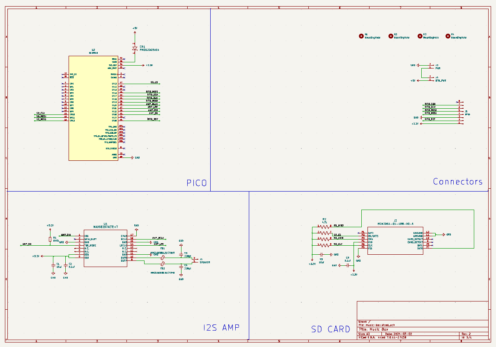
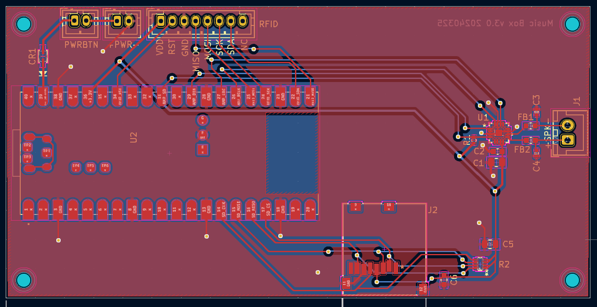

# Music Box

A rfid based player I made. It basically scans for RFID takes, and looks for a WAV file on the SD card with that ID, if found it plays it.
The WAV files need to be 22khz, 16bit mono. Audacity is a good tool to convert mp3s.

## Board

The board is simply a pico with and SD card and the I2S chip.

See KiCad files.

### Schematic

### PCB

### BOM

<table>
<tr><td>CR1</td><td>PMEG2005AEA</td><td>https://uk.farnell.com/nexperia/pmeg2005aea-115/diode-schottky-sod-323/dp/8737843?st=pmeg2005aea</td></tr>
<tr><td>J2</td><td>GCT MEM2061-01-188-00-A</td><td>https://uk.farnell.com/gct-global-connector-technology/mem2061-01-188-00-a/micro-sd-conn-push-push-8pos-smt/dp/2678544?ost=mem2061-01-188-00-a</td></tr>
<tr><td>C6, C2</td><td>0.1uf, 0603</td><td></td></tr>
<tr><td>C5, C1</td><td>10uf, 0805</td><td></td></tr>
<tr><td>R2</td><td>Array, 4x 47k (EXB-N8V473JX)</td><td>https://uk.farnell.com/panasonic/exbn8v473jx/resistor-ccav-array-0402x4-47k/dp/2060146?st=EXBN8V473JX</td></tr>
<tr><td>R6</td><td>649k, 0402</td><td></td></tr>
<tr><td>U1</td><td>I2S Amp, MAX98357AETE+T</td><td>https://uk.farnell.com/analog-devices/max98357aete-t/audio-power-amp-d-40-to-85deg/dp/2949165?st=MAX98357AETE%20T</td></tr>
<tr><td>FB1, FB2</td><td>Ferrite Beads, MMZ1608B121CTDH5</td><td>https://uk.farnell.com/tdk/mmz1608b121ctdh5/ferrite-chip-bead-1608-0-15-ohm/dp/3386884?st=mmz1608b121ctdh5</td></tr>
<tr><td>C4,C3</td><td>220pf, 0402</td><td></td></tr>
<tr><td>J1</td><td>JST, XH 2.5mm</td><td></td></tr>
<tr><td>J4, J3, J5</td><td>JST, PH, 2mm</td><td></td></tr>

</table>

## Software

Flash circuit python (originally I used v9) and copy the lib folder and `code.py` files over. That should be it.

## Case

See FreeCad files in `3dPrinting`, you will need a usbc power board as well to power it (see https://github.com/a-mueller/usbc_power_supply_2)

